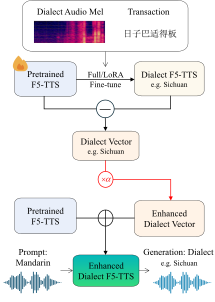
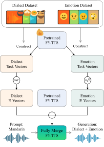
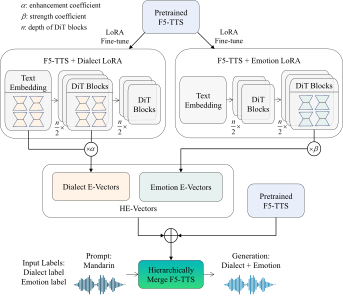

Task Vector in TTS: Toward Emotionally Expressive Dialectal Speech Synthesis


<div align="center">
    <a href="https://github.com/the-bird-F/Expressive-Vectors" target="_blank">
    </a>
    <a href="https://the-bird-f.github.io/Expressive-Vectors/" target="_blank"> </a> 
    <!-- <a href="https://arxiv.org/abs/2505.00028" target="_blank">
    </a> -->
</div>


<p align="center">
  <span>
    
    
    
  </span>
</p>


---

## ✨ Overview 
We propose **Hierarchical Expressive Vector (HE-Vector)**, a two-stage method for Emotional Dialectal TTS.

In the first stage, we construct different task vectors to model dialectal and emotional styles independently, and then enhance single-style synthesis by adjusting their weights, a method we refer to as Expressive Vector (E-Vector).

For the second stage, we hierarchically integrate these vectors to achieve controllableemotionally expressive dialect synthesis without requiring jointly labeled data, corresponding to Hierarchical Expressive Vector (HE-Vector).


## Dataset

### Dialect Datasets
- **Sichuan Dialect (Sichuanhua)**: [MagicData Sichuan Dialect Scripted Speech Corpus](https://magichub.com/datasets/sichuan-dialect-scripted-speech-corpus-daily-use-sentence/)
- **Cantonese (Guangdonghua)**: [MagicData Guangzhou Cantonese Scripted Speech Corpus](https://magichub.com/datasets/guangzhou-cantonese-scripted-speech-corpus-daily-use-sentence/)
- **Shanghai Dialect (Shanghainese)**: [MagicData Shanghai Dialect Scripted Speech Corpus](https://magichub.com/datasets/shanghai-dialect-scripted-speech-corpus-daily-use-sentence/)

### Emotional Speech Dataset
- **Emotional Speech Data**: [HLTSingapore/Emotional-Speech-Data](https://github.com/HLTSingapore/Emotional-Speech-Data)

> Note: The original dialect data used in the paper experiments cannot be openly shared. As an alternative, we provide links to the MagicData dialect datasets. Our experiments confirm that training on these datasets achieves comparable performance.

## 🚀 Quick Start

### Prerequisites and Base Model Setup
```bash
# 1. Create and activate conda environment
conda create -n f5-tts python=3.11 -y
conda activate f5-tts

# 2. Install PyTorch with CUDA 12.4 support
pip install torch==2.4.0+cu124 torchaudio==2.4.0+cu124 \
  --extra-index-url https://download.pytorch.org/whl/cu124

# 3. Clone repository with all submodules
git clone --recurse-submodules https://github.com/the-bird-F/Expressive-Vectors.git
cd Expressive-Vectors

# 4. Install F5-TTS (already included as submodule)
# git submodule update --init --recursive 
cd F5-TTS
pip install -e .
cd ..

# 5. Set up Python Path
cd ..
export PYTHONPATH=./F5-TTS/src:$PYTHONPATH
```


### E-Vector(Expressive Vector) Training & Inference
```bash
# Step 1: Fine-tune the base model
bash ./scripts/finetuning_model.sh

# Step 2: Extract expressive vectors from the fine-tuned model
bash ./scripts/mining_model.sh

# Step 3: Evaluate model performance
bash ./scripts/evaluation_model.sh
```

### HE-Vector(Hierarchical Expressive Vector) Training & Inference
```bash
# Training phase
bash ./scripts/train_he_vector.sh

# Inference phase
bash ./scripts/infer_he_vector.sh
```

## 🔬 Experiment Details

### Hardware Configuration
- GPU: NVIDIA RTX 4090

### Training Hyperparameters
```bash
learning_rate: 1e-5
batch_size_per_gpu: 8000
batch_size_type: "frame"
max_samples: 64
grad_accumulation_steps: 1
max_grad_norm: 1.0
epochs: 1000
num_warmup_updates: 20000
save_per_updates: 20000
last_per_updates: 5000
finetune: True
pretrain: ./ckpts/F5TTS_v1_Base/model_1250000.pt
tokenizer: "pinyin"

target_sample_rate = 24000
n_mel_channels = 100
hop_length = 256
win_length = 1024
n_fft = 1024
mel_spec_type = "vocos"
```


## 🙏 Acknowledgements

This project builds upon:
- [F5-TTS](https://github.com/SWivid/F5-TTS.git)


## 📄 License

The code in this repository is released under the [Apache 2.0](LICENSE) license.


If you find this project helpful, feel free to ⭐️ Star and 🔁 Fork it!
