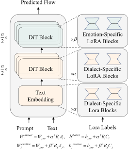

<h1 align="center">
Expressive Vectors: Toward Emotionally Expressive Dialectal Speech Synthesis
</h1>

    
    <!--  -->

  
    
    
    
    <!--  -->
  

---

## ✨ Overview 

## 🚀 Quick Start

## 📄 License

The code in this repository is released under the [Apache 2.0](LICENSE) license.

If you find this project helpful, feel free to ⭐️ Star and 🔁 Fork it!
